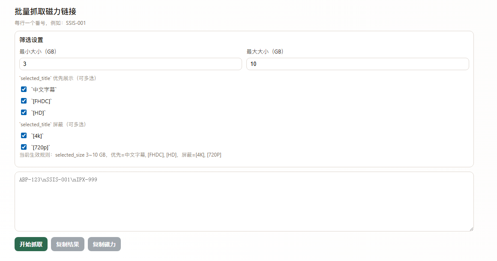

# Batch Javbus Helper (Chrome Extension)

一个用于批量处理番号查询结果的 Chrome 扩展，支持区间筛选、`selected_title` 规则、历史记录和候选过滤调试日志。

## 界面截图

> 请将插件界面截图保存到 `docs/screenshots/ui-main.png` 后，README 会自动显示。



## 功能

- 批量输入番号：每行一个番号，支持去重。
- 区间大小筛选：按 `selected_size` 匹配 `minSizeGB ~ maxSizeGB`。
- `selected_title` 规则：
  - 优先展示（可多选）：`中文字幕`、`[FHDC]`、`[HD]`
  - 屏蔽（可多选）：`[4K]`、`[720P]`
- 调试日志面板：逐条展示候选过滤原因（默认折叠，点击展开）。
- 历史记录：本地缓存、倒序展示、支持导出 JSON、清空历史。
- 复制能力：
  - 复制结果（TSV）
  - 仅复制磁力链接（去重）

## 安装

1. 打开 `chrome://extensions/`
2. 开启右上角「开发者模式」
3. 点击「加载已解压的扩展程序」
4. 选择当前目录：`d:\VScodeWorkSpace\javbus`

## 使用

1. 配置筛选规则（区间大小、优先展示、屏蔽）
2. 在输入框每行填一个番号
3. 点击「开始抓取」
4. 在结果表查看：状态、`selected_size`、匹配数
5. 如需排查，展开「调试日志（候选过滤明细）」查看逐条原因

## 调试日志字段说明

- `selected`: 被最终选中
- `size_out_of_range`: 超出大小区间
- `title_excluded`: 命中屏蔽词
- `not_selected_by_priority`: 通过过滤但优先级未胜出
- `no_debug_from_worker`: 后台未返回详细日志，前端兜底生成

## 结果状态

- `ok`: 成功选中结果
- `filtered_out`: 有候选但全部被过滤
- `not_found`: 未找到候选
- `error`: 处理异常

## 项目结构

- `manifest.json`: 扩展清单（MV3）
- `src/background.js`: 后台抓取与筛选逻辑
- `src/popup.html`: 页面结构
- `src/popup.css`: 页面样式（自适应）
- `src/popup.js`: 页面交互、设置持久化、历史、调试展示

## 本地校验

```powershell
node --check src/background.js
node --check src/popup.js
```
